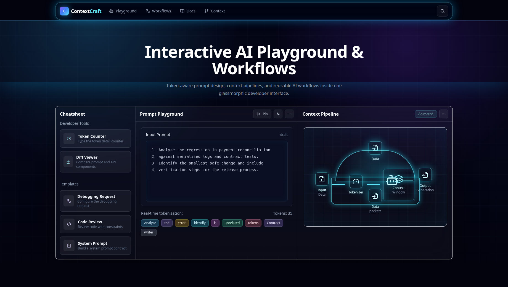

# ContextCraft

ContextCraft is a polished AI cheatsheet and workflow playground for developers who want practical prompt engineering, context engineering, and reusable AI workflows in one place.

It is built as a fast, static Next.js app with a dark glassmorphic interface, searchable prompt templates, concise AI concept pages, and copy-ready workflow patterns.



## What It Is

ContextCraft is not a generic AI notes site. It is a hands-on reference for using AI systems more effectively:

- Learn the core ideas behind LLMs, tokens, context windows, embeddings, and limitations.
- Copy prompt templates for debugging, code review, research, writing, learning, and planning.
- Understand prompt engineering patterns such as roles, constraints, examples, and structured outputs.
- Explore context engineering techniques for packing goals, facts, evidence, tools, and verification steps.
- Use workflow pages when you need a repeatable process instead of a one-off prompt.

## Cheatsheet Highlights

| Area | What You Get |
| --- | --- |
| AI Basics | Short explanations of essential AI concepts before advanced prompting. |
| Prompt Engineering | Practical patterns for clearer instructions and reliable model output. |
| Context Engineering | Guidance for giving models the right evidence in the right shape. |
| Prompt Library | Searchable, copy-ready templates organized by category and difficulty. |
| AI Workflows | Step-by-step systems for debugging, review, research, learning, and planning. |
| Latest AI News | A cached live feed of official AI updates and industry reporting. |
| Global Search | Quick access to prompts, concepts, and workflows from anywhere in the app. |

## Built-In Prompt Patterns

ContextCraft includes reusable prompt formats for:

- Debugging software issues with logs, constraints, and suspected causes.
- Senior code review focused on correctness, security, regressions, and tests.
- Rewriting vague prompts into precise instruction sets.
- Creating structured JSON outputs.
- Planning learning paths and research summaries.
- Turning messy task descriptions into clear AI-ready requests.

## Why It Looks Different

The interface is designed like a developer cockpit instead of a plain documentation page:

- Dark-only visual system for consistency.
- Glassmorphic panels and cards.
- Token-aware playground preview.
- Context pipeline visualization.
- Dense, readable layouts for repeat use.
- Mobile-friendly documentation and prompt browsing.

## Tech Stack

- Next.js App Router
- React
- TypeScript
- Tailwind CSS
- Fuse.js search
- Lucide icons
- MDX-ready Next configuration

## Getting Started

Install dependencies:

```bash
npm install
```

Run the development server:

```bash
npm run dev
```

Open:

```txt
http://localhost:3000
```

## Quality Checks

Run these before deploying:

```bash
npm run typecheck
npm run lint
npm run build
```

## Deploying To Vercel

Recommended Vercel settings:

| Setting | Value |
| --- | --- |
| Framework Preset | Next.js |
| Install Command | `npm ci` |
| Build Command | `npm run build` |
| Output Directory | Default |
| Root Directory | `ContextCraft/ContextCraft` if deploying from the parent repo |

The app is static/SSG friendly and does not require environment variables for the current version.

## Project Structure

```txt
app/             Next.js routes and global app shell
components/      Reusable UI and content components
data/            Prompt, concept, and workflow data
lib/             Shared utilities
public/          Static assets, including README screenshots
types/           Shared TypeScript content models
```

## Current Scope

The current version focuses on a strong AI cheatsheet experience:

- Static concept pages
- Searchable prompt library
- Global keyboard search
- Workflow guidance
- Copy-ready prompts
- Responsive dark UI
- Live AI news from multiple RSS and Atom sources

Accounts, saved prompts, AI API calls, and community submissions are intentionally left for later versions and more.
